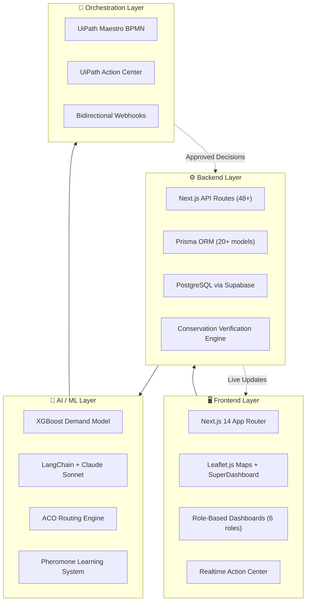
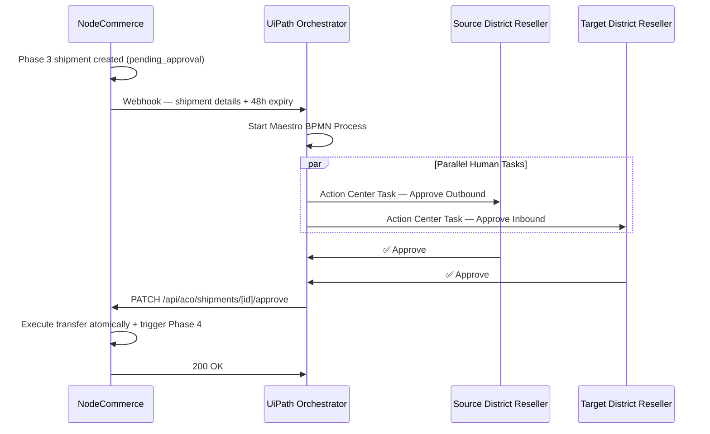
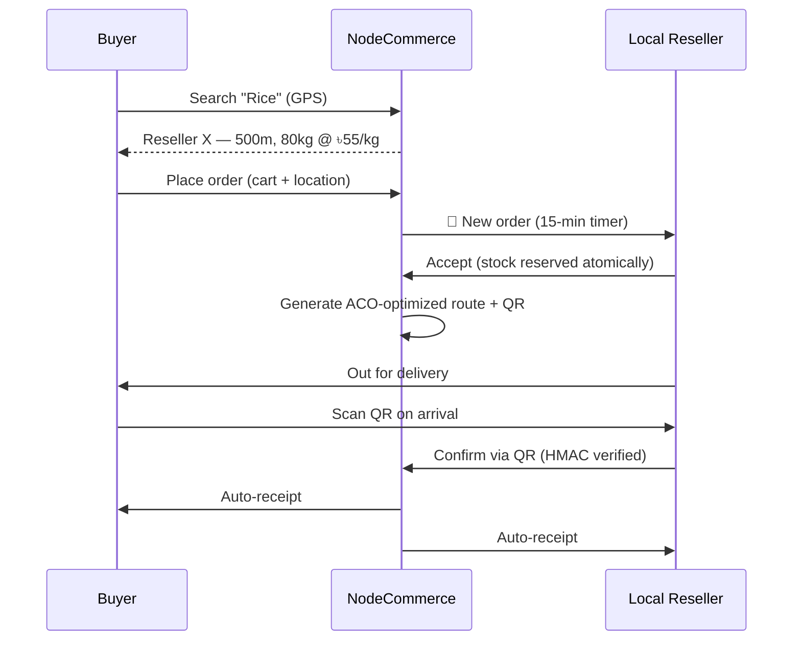

# 🇧🇩 NodeCommerce Bangladesh

### *"We don't predict the future. We route stock there first."*

**A decentralized, AI-native, multi-tier supply chain & e-commerce operating system for Bangladesh — built for UiPath AgentHack 2024, Track 2 (Maestro / BPMN), Demand Forecasting AI Challenge.**


> **One-sentence summary:** NodeCommerce is a decentralized, AI-forecasted, Ant-Colony-Optimized supply chain operating system that turns every local shop in Bangladesh into a smart, pre-stocked node — so products arrive near the buyer *before* the buyer even searches.

---

## 📑 Table of Contents

1. [Overview](#-overview)
2. [The Problem](#-the-problem)
3. [Our Solution](#-our-solution)
4. [System Architecture](#-system-architecture)
5. [The Supply Chain Hierarchy](#-the-supply-chain-hierarchy)
6. [The 4-Phase ACO Engine](#-the-4-phase-aco-engine)
7. [Demand Forecasting Intelligence](#-demand-forecasting-intelligence)
8. [The Agentic Layer — UiPath + LangChain](#-the-agentic-layer--uipath--langchain)
9. [Last-Mile Delivery](#-last-mile-delivery)
10. [Mathematical Guarantees — Conservation](#-mathematical-guarantees--conservation)
11. [Tech Stack](#-tech-stack)
12. [Project Structure](#-project-structure)
13. [Getting Started](#-getting-started)
14. [API Reference Overview](#-api-reference-overview)
15. [Hackathon Context](#-hackathon-context)
16. [Roadmap](#-roadmap)
17. [Contributing](#-contributing)
18. [License](#-license)

---

## 🌍 Overview

NodeCommerce Bangladesh is a **decentralized supply chain mesh**, not a single warehouse with a website bolted on top. Every seller, local shop, sub-district (upazilla) hub, district hub, and buyer is a **node** in a live network. An AI layer continuously forecasts what each node will need, and an **Ant Colony Optimization (ACO)** engine moves real inventory between nodes — bottom-up first to satisfy hyper-local demand, then sideways and top-down to balance the rest of the country.

A human governance layer, powered by **UiPath Maestro + Action Center**, sits on top of the highest-stakes decisions (inter-district transfers, weekly demand recalibration), so the system stays **AI-assisted, not AI-controlled**.

The result is a platform where:

- A buyer in Mirpur searches for rice and finds it **500 meters away**, at a local shop, because the AI already routed stock there **three days earlier**.
- A seller never has to guess where to send their products — the system tells them, and they accept or reject in one tap.
- A district manager only has to make a decision when it actually matters (an inter-district truck), and even then, UiPath hands them the decision on a plate.

---

## 🚨 The Problem

### Centralized e-commerce is structurally lossy

Bangladesh's e-commerce sector has largely copied a model built for dense, single-city markets: **one central warehouse → one courier network → every order, regardless of distance**. This model is capital-intensive, reactive, and — at scale — loses money by design.

Look at **Daraz**, the Alibaba-backed marketplace operating across Pakistan, Bangladesh, Sri Lanka, Nepal, and Myanmar since 2012. Despite a controlling acquisition by Alibaba in 2018 (reported around $200M) and 30M+ shoppers across the region, Daraz Group has needed continuous capital injections to stay alive — accumulating an estimated **$750M in losses** on its balance sheet group-wide, with Alibaba pumping in roughly **$884M total** to date, including a single-year $129M cash injection plus a $29M loan-to-equity conversion. Meanwhile group revenue has been essentially flat for years — around $127M, still below its earlier peak near $154M.

This isn't a story about one company being badly run. It's a story about **what the centralized model costs, structurally**, even for a company backed by one of the world's largest tech conglomerates.

### Why does a blind centralized system bleed money?

1. **Reactive logistics, not predictive.** Stock sits in central warehouses until an order comes in — *then* the system reacts: pick, pack, ship, hope the courier is on time. Nothing is pre-positioned near demand because the system has no concept of "local demand" — only "total demand at the warehouse."

2. **Reverse logistics is a hidden tax.** Every return must be picked up, transported back to a hub, inspected, re-shelved or written off, and re-listed. Centralized platforms must price this cost *into every single transaction up front* — which is why margins on centralized marketplaces are often padded by 10-20% just to absorb returns that may never happen for a given order.

3. **Courier dependency is a single point of failure.** When the entire last mile depends on third-party courier networks, delays, lost parcels, and failed deliveries become *the platform's* reputation problem — but the platform has almost no control over the actual delivery experience.

4. **Route cost scales with distance, not value.** Sending a BDT 300 item 300km costs nearly as much in fuel and time as sending a BDT 3,000 item the same distance. Centralized warehousing means *every* order pays the "distance tax," regardless of whether a closer source existed.

5. **"Resellers" aren't producers — they're resellers of resellers.** On most marketplaces, the person listing a product is rarely the manufacturer. They're a small seller who bought from another seller, who bought from a distributor. There's no real local presence, no accountability, and — critically — **no local trust**. Buyers in Bangladesh are repeatedly burned by sellers who vanish after taking payment, which is a major reason e-commerce adoption outside Dhaka remains low.

6. **Stock sync is manual and constantly wrong.** Sellers update stock counts via spreadsheets or dashboards that drift out of sync with physical reality. The result: "in stock" items that aren't, cancelled orders, refund cycles, and buyer trust erosion — compounding problem #2 and #5 simultaneously.

NodeCommerce was designed specifically to attack **all six of these** at the architecture level — not as a feature list, but as the foundation the entire system is built on.

---

## 💡 Our Solution

NodeCommerce replaces "one warehouse, one courier, react to every order" with **"many small nodes, AI-forecasted, ACO-routed, locally trusted."**

|
 Centralized Model 
|
 NodeCommerce Model 
|
|
---
|
---
|
|
 One central warehouse 
|
 Thousands of local reseller nodes 
|
|
 React to orders after they happen 
|
 Pre-position stock based on forecasted demand 
|
|
 Courier handles all last-mile 
|
 Local reseller 
*
is
*
 the last mile — they're your neighbor 
|
|
 Returns flow back to central hub 
|
 Surplus flows sideways/locally via ACO, rarely needs reversal 
|
|
 Stock sync via manual dashboards 
|
 Atomic, transactional, product-code-based stock tracking 
|
|
 "Seller" = anonymous online identity 
|
 "Local Reseller" = a real shop you can walk to 
|

Three engines power this:

- **Macro demand forecasting (XGBoost):** Learns country-wide seasonal and regional demand patterns — similar in spirit to how Amazon forecasts regional fulfillment-center needs months in advance.
- **Micro demand aggregation (bottom-up):** Every local reseller's real-time sales and stock-outs roll up into upazilla demand, then district demand — the system always knows the *true*, current, hyper-local picture, not a stale warehouse estimate.
- **ACO routing engine:** Decides, in real time, which seller's stock goes to which local node, in what order, on which truck — optimizing for distance, urgency, and historical route success ("pheromone" trails).

A human governance layer (UiPath) sits at the two decision points where mistakes are expensive: **inter-district transfers** and **weekly demand recalibration**. Everything else is automatic.

---

## 🏗️ System Architecture



**Infrastructure:** Supabase (Auth + Postgres + Storage + Realtime), Vercel (frontend), FastAPI (Python ML/LangChain microservice), UiPath Cloud Orchestrator.

---

## 🪜 The Supply Chain Hierarchy

NodeCommerce models Bangladesh's actual administrative geography: **8 divisions → 64 districts → ~500 upazillas → thousands of local shops**. Every role in the system maps to a real-world counterpart.

```mermaid
graph TD
    Seller["🏭 Seller / ProducerLists products, AI-moderated"]
    LR["🏪 Local ResellerThe neighborhood shop"]
    UR["🏢 Upazilla ResellerSub-district hub"]
    DR1["🏛️ District Reseller ADistrict hub"]
    DR2["🏛️ District Reseller BAnother district hub"]
    CR["🌆 City ResellerMajor city node"]
    Buyer["🧍 BuyerSearches by location + product code"]
    SD["🗺️ SuperDashboardGod-view / AI control room"]

    Seller -->|"Phase 1: stock"| UR
    UR -->|"Phase 1b: distribute"| LR
    LR -->|"sells to"| Buyer
    Seller -->|"Phase 2: surplus"| DR1
    UR -->|"Phase 2: surplus"| DR1
    DR1 |"Phase 3: Inter-District ACO(UiPath dual approval)"| DR2
    DR2 -->|"Phase 4: distribute"| UR
    DR1 --> CR

    SD -.->|"monitors & triggers"| Seller
    SD -.-> UR
    SD -.-> DR1
    SD -.-> DR2
```

|
 Role 
|
 Real-world equivalent 
|
 Core responsibility 
|
|
---
|
---
|
---
|
|
**
Seller
**
|
 Manufacturer / wholesaler / large producer 
|
 Lists products (AI-moderated via Ollama), holds bulk stock 
|
|
**
Local Reseller
**
|
 Neighborhood shop / kirana store 
|
 Holds local stock, is the actual point of sale and delivery for buyers — 
**
the trust layer
**
|
|
**
Upazilla Reseller
**
|
 Sub-district distribution hub 
|
 Aggregates local demand, receives Phase 1 stock, distributes to local resellers 
|
|
**
District Reseller
**
|
 District-level depot 
|
 Manages surplus, participates in Phase 2/3/4 ACO 
|
|
**
City Reseller
**
|
 Metro distribution node 
|
 Handles high-density urban routing for major cities 
|
|
**
Buyer
**
|
 End consumer 
|
 Searches by GPS + product code, orders from the 
*
nearest
*
 stocked reseller 
|
|
**
SuperDashboard
**
|
 Operations control room 
|
 Live Leaflet map of every node, pheromone trails, ACO trigger, conservation reports 
|

---

## 🐜 The 5-Phase ACO Engine

At the heart of NodeCommerce is a custom **Ant Colony Optimization** engine that decides, every cycle, exactly which stock moves where — across **multiple products simultaneously**, bundled onto shared "trucks" (`ACOShipment` records with a 500-unit capacity each).

### The ACO Score Formula

```
score(source → destination) =
    (demandDeficit ^ ALPHA)
  × (1 / distanceKm ^ BETA)
  × (pheromoneScore ^ GAMMA)
  × ((waitingDays + 1) ^ DELTA)

ALPHA = 2.0   (demand weight)
BETA  = 1.5   (distance weight)
GAMMA = 1.2   (pheromone / route-history weight)
DELTA = 0.8   (urgency weight — older demand scores higher)
```

Routes that are used successfully gain **pheromone strength** (`RoutePheromone`) and evaporate at 10% per day if unused — the system literally *learns* which routes work best over time, the same way real ant colonies reinforce efficient foraging paths.

### Phase 1 — Local Collection (Seller → Upazilla)

The seller's stock first fills the demand of **their own upazilla**. This is non-negotiable: local demand always has the highest priority, regardless of how much surplus exists elsewhere. Shipments here are auto-`dispatched` — no approval needed, because it's purely intra-upazilla.

### Phase 2 — Upward Aggregation (Upazilla → District)

Whatever stock remains after Phase 1 — and whatever the district hub still needs — flows **upward** to the district hub, where it becomes available for Phase 2 redistribution to *other* upazillas in the same district, or sits as district-level surplus.

### Phase 3 — Inter-District Rebalancing (District ↔ District)

If District A still has surplus after Phases 1-2, and District B has unmet demand, the ACO engine proposes an inter-district transfer. **This is the only phase that requires human approval** — both the source and target District Resellers must approve via UiPath Action Center before a single unit moves.

### Phase 4 — Downward Distribution (District → Upazillas)

Once a Phase 3 shipment is approved and arrives, the receiving district's hub runs **its own local ACO** to push the newly-arrived stock down to whichever of its upazillas are most starved — exactly like Phase 2, but at the destination.

### Phase 5 — Final Mile Distribution (Upazilla → Local Reseller)

Whatever stock lands in the Upazilla Hub from Phase 4 (or directly from Phase 1) is then pushed down via Phase 5 to the specific **Local Resellers** in that Upazilla. This eliminates any remaining guesswork—stock physically arrives at the local kirana store or neighborhood shop, waiting to be purchased.

```mermaid
flowchart LR
    subgraph P1["🟢 Phase 1: Local Collection"]
        S1["Seller Stock(Mirpur)"] -->|"fills local demandauto-dispatched"| U1["Mirpur Upazilla Hub"]
    end

    subgraph P2["🔵 Phase 2: Upward Aggregation"]
        U1 -->|"surplusauto-dispatched"| D1["Dhaka District Hub"]
        S1 -->|"surplus"| D1
    end

    subgraph P3["🟣 Phase 3: Inter-District ACO"]
        D1 |"pending_approvaldual sign-off via UiPath"| D2["Chittagong District Hub"]
    end

    subgraph P4["🟠 Phase 4: Downward Distribution"]
        D2 -->|"local ACO re-run"| U2["Agrabad Upazilla"]
        D2 -->|"local ACO re-run"| U3["Pahartali Upazilla"]
    end
    
    subgraph P5["🔴 Phase 5: Final Mile"]
        U2 -->|"local ACO re-run"| L1["Pahartali Local Reseller 1"]
        U2 -->|"local ACO re-run"| L2["Pahartali Local Reseller 2"]
    end

    P1 --> P2 --> P3 --> P4 --> P5
```

### Worked Example

> A seller in **Mirpur (Dhaka)** has **1,000 kg of rice**.
>
> - **Phase 1:** Mirpur's own demand is 300 kg → 300 kg fulfilled instantly, marked `dispatched`. Remaining: 700 kg.
> - **Phase 2:** Other Dhaka upazillas (Dhanmondi, Uttara) need a combined 250 kg → routed via one bundled multi-product truck, `dispatched`. Remaining at Dhaka hub: 450 kg.
> - **Phase 3:** Dhaka's own demand is now fully met (surplus = 450 kg). Chittagong has 300 kg of unmet rice demand. ACO proposes Dhaka → Chittagong, 300 kg. **Both district managers approve via UiPath Action Center.** Shipment executes. Remaining at Dhaka hub: 150 kg (held as district reserve).
> - **Phase 4:** Chittagong's hub re-runs ACO locally and distributes the 300 kg across Agrabad (180 kg) and Pahartali (120 kg) based on their relative demand deficits and distances.
> - **Phase 5:** Agrabad Upazilla Hub distributes its 180 kg to Agrabad Local Reseller 1 (100 kg) and Agrabad Local Reseller 2 (80 kg) based on their respective demands.
>
> **Conservation check:** 300 + 250 + 300 + 150 = **1,000 kg** ✅ — nothing created, nothing lost, only moved.

---

## 📈 Demand Forecasting Intelligence

NodeCommerce combines two complementary forecasting layers — a **macro model** and a **micro signal network** — the same dual-layer approach pioneered by large-scale fulfillment networks, adapted for a hyper-fragmented market.

### Macro layer — XGBoost

A gradient-boosted model trained on country-wide and regional historical sales, seasonality (Eid, harvest cycles, exam seasons), and cross-product correlations. It produces a **7-14 day rolling forecast** per product per region — the "big picture" signal that tells the ACO engine where demand is *trending*, even before local signals catch up.

### Micro layer — Bottom-up aggregation

Every `UpazillaDemand` record is the ground truth. Local resellers' real sales, stock depletion events, and even **unmet buyer searches** (a buyer searched for "pen" and found nothing) roll up into `DistrictDemand` automatically (`@@unique([upazillaResellerId, productName])` ensures one live demand record per product per node — no double-counting).

### Contextual demand — the human signal AI can't infer alone

Some demand spikes are *predictable to humans but invisible to any model* — because they depend on local knowledge an algorithm has no way to know:

> *"আমাদের এলাকায় HSC পরীক্ষা আসছে, কলম-পেন্সিল দরকার বেশি।"*
> *("Our area has HSC exams coming up — we'll need more pens and pencils.")*

A local reseller submits this as a `ManualDemandRequest` (product, quantity, event type, date range). The **Autonomous Weekly Demand Agent** (below) validates it against historical exam-season data, and — if reasonable — folds it directly into the next forecast cycle.

### Pheromone learning

Every successful ACO route strengthens its `RoutePheromone` score; every unused route slowly decays (10%/day evaporation). Over weeks, the system organically discovers the *real* efficient corridors of Bangladesh's road network — without anyone hand-coding a single route.

---

## 🤖 The Agentic Layer — UiPath + LangChain

NodeCommerce uses AI for **speed and pattern-finding**, and UiPath + humans for **judgment and accountability**. Two autonomous agents bridge these worlds.

### Agent 1 — Phase 3 Human-in-the-Loop Approval

Every inter-district shipment is too consequential to automate blindly — it commits a truck, fuel, and time across district lines. So NodeCommerce fires a webhook to **UiPath Orchestrator** the moment a Phase 3 shipment is created, which kicks off a Maestro BPMN process:



If UiPath is unreachable, the shipment **still exists** in NodeCommerce and either district reseller can approve directly from their dashboard — UiPath adds governance and a polished UI, but is never a single point of failure.

### Agent 2 — Autonomous Weekly Demand Agent

Every **7 days** (or on manual trigger from the SuperDashboard), this agent runs a full demand-recalibration cycle:

1. **Collect** — 7-day sales, stock-depletion events, unmet buyer searches, and manual `ManualDemandRequest` submissions from every upazilla.
2. **Analyze** — Sends the full dataset to a LangChain + Claude Sonnet endpoint, which returns demand-change proposals with **confidence scores** (e.g., *"Rice demand in Mirpur +40%, confidence 0.85, reason: 7-day sales trend"*).
3. **Review** — One Action Center task per district, summarizing proposals in a table; the district reseller can approve, reject, or edit each line. Unanswered tasks auto-approve at confidence ≥ 0.8 after 24 hours.
4. **Apply** — Approved proposals are written back via `/api/agent/demand-apply`, updating `UpazillaDemand` and `DistrictDemand`. If aggregate change exceeds 20%, the global ACO is re-triggered immediately.

### Truck & Negotiation Layer

Before ACO executes, sellers receive a **price negotiation request** (`SellerACONegotiation`) for the exact quantity the system needs — accept, counter, or reject, with a 6-hour auto-accept-at-system-price fallback. Approved stock becomes "ACO-valid," and the truck router (`buildTruckPlans`) bin-packs multi-product loads into 500-unit trucks with a full stop-by-stop route. At every stop — pickup or delivery — the relevant seller or reseller gets a **real-time Action Center notification** to accept, reject, or partially fulfill, with a 30-minute auto-resolution timeout.

---

## 🚚 Last-Mile Delivery

Once stock has settled at a local reseller, the buyer-facing loop closes:

1. **Location-based search** — Buyer's GPS is matched against local resellers in the *same upazilla* holding the requested `productCode`, sorted by distance.
2. **Cart with real location** — The cart captures buyer lat/lng and address automatically; all items in one order must come from one reseller.
3. **Accept / reject window** — The reseller has **15 minutes** to accept; on accept, stock is atomically reserved.
4. **ACO-optimized route** — When 2+ orders are accepted, a nearest-neighbor route is generated (`optimizeDeliveryRoute`), with new orders insertable mid-route if it adds <30% distance.
5. **QR confirmation** — Each order carries an **HMAC-signed QR code** (`orderNumber_buyerId_resellerId_timestamp_signature`, 48h expiry). Scanning it on delivery marks the order `delivered` atomically.
6. **Auto-receipts** — Both buyer and reseller instantly receive a generated receipt (Bangla footer: *"ধন্যবাদ! আবার কিনুন।"*).



---

## ✅ Mathematical Guarantees — Conservation

Every stock movement in NodeCommerce is verified against **five invariants**, checked after every ACO phase and exposed via `/api/aco/verify-conservation`:

1. `reservedQuantity + surplusQuantity <= quantity` — on every stock item, always.
2. `remainingDemand = totalDemand - fulfilledByUpazillas` — on every district demand, always.
3. `remainingDemand >= 0` — demand can never go negative.
4. `transfer.quantity <= sourceStock.quantity` at the moment of creation — no transfer can ever overdraw its source.
5. **Conservation** — stock is created only at seller intake or manual district top-up, and destroyed only at sale or explicit write-off. Every ACO phase only **moves** units; it never creates or deletes them.

If any invariant fails, the responsible `$transaction` rolls back entirely — a single unit's arithmetic error blocks the whole operation rather than silently corrupting downstream state.

---

## 🛠️ Tech Stack

|
 Layer 
|
 Technology 
|
|
---
|
---
|
|
 Frontend 
|
 Next.js 14 (App Router), TypeScript, Tailwind CSS 
|
|
 Maps & Visualization 
|
 Leaflet.js, React Flow (SuperDashboard "God View") 
|
|
 Database 
|
 PostgreSQL via Supabase, Prisma ORM (20+ models) 
|
|
 Auth 
|
 Supabase Auth (email/password, role-based) 
|
|
 AI — Product Moderation 
|
 Ollama (
`qwen2.5-coder:7b`
), local "ISPAT" gatekeeper 
|
|
 AI — Demand Forecasting 
|
 XGBoost (Python/FastAPI), LangChain + Claude Sonnet 
|
|
 Routing Engine 
|
 Custom TypeScript ACO engine (
`/lib/aco-multi-engine.ts`
) 
|
|
 Orchestration 
|
 UiPath Maestro (BPMN), UiPath Orchestrator, Action Center 
|
|
 Security 
|
 HMAC-SHA256 signed QR codes, OAuth2 client credentials (UiPath) 
|
|
 Deployment 
|
 Vercel (frontend), Supabase (backend), FastAPI microservice 
|

---

## 📁 Project Structure

```
nodecommerce-bangladesh/
├── prisma/
│   └── schema.prisma          # 20+ models: roles, stock, demand, ACO
├── src/
│   ├── app/
│   │   ├── api/
│   │   │   ├── aco/            # global-trigger, jobs, shipments, pheromones
│   │   │   ├── agent/           # demand-pulse, demand-apply, demand-request
│   │   │   ├── delivery/        # search, orders, route, qr-confirm
│   │   │   ├── demand/          # upazilla, district
│   │   │   ├── district-reseller/
│   │   │   ├── upazilla-reseller/
│   │   │   ├── seller/
│   │   │   ├── uipath/          # webhook callbacks
│   │   │   └── superdashboard/
│   │   ├── superdashboard/      # Leaflet "God View"
│   │   ├── seller/ | buyer/ | local-reseller/
│   │   ├── upazilla-reseller/ | district-reseller/ | city-reseller/
│   ├── components/
│   │   ├── aco/                 # TruckRouteMap, ShipmentPipelinePanel
│   │   ├── shared/               # RealtimeActionCenter
│   │   └── superdashboard/       # PheromoneLayer, GlobalACOControl
│   └── lib/
│       ├── aco-multi-engine.ts   # core ACO math (pure functions)
│       ├── aco-distance.ts       # Haversine + centroid lookups
│       ├── truck-router.ts       # bin-packing + route planning
│       ├── delivery-router.ts    # last-mile nearest-neighbor routing
│       ├── qr-generator.ts        # HMAC QR codes
│       └── uipath-client.ts       # OAuth + Orchestrator API client
├── scripts/
│   └── hackathon-verify.ts        # 53-test demo readiness suite
└── fastapi-service/                # XGBoost + LangChain microservice
```

---

## 🚀 Getting Started

### Prerequisites

- Node.js 20+
- A Supabase project (PostgreSQL + Auth)
- Python 3.11+ (for the FastAPI/LangChain/XGBoost microservice)
- A UiPath Cloud Orchestrator tenant (optional for local dev — Phase 3 falls back to manual approval)

### Setup

```bash
# 1. Clone and install
git clone https://github.com/your-org/nodecommerce-bangladesh.git
cd nodecommerce-bangladesh
npm install

# 2. Configure environment
cp .env.example .env.local
# fill in DATABASE_URL, NEXT_PUBLIC_SUPABASE_URL,
# NEXT_PUBLIC_SUPABASE_ANON_KEY, QR_SECRET, AGENT_SECRET,
# UIPATH_* credentials (optional)

# 3. Push schema and generate client
npx prisma db push
npx prisma generate

# 4. Run the dev server
npm run dev

# 5. (Optional) Run the FastAPI ML microservice
cd fastapi-service
pip install -r requirements.txt --break-system-packages
uvicorn main:app --reload --port 8000
```

### Verifying a demo is ready

```bash
npm run verify-demo
```

This runs a 53-test suite across system health, demo data, ACO pipeline, UiPath integration, conservation invariants, and frontend smoke tests — producing a CRITICAL / HIGH / MEDIUM pass-rate report before any live demo.

---

## 🔌 API Reference Overview

|
 Endpoint 
|
 Purpose 
|
|
---
|
---
|
|
`POST /api/aco/global-trigger`
|
 Run the full multi-product 4-phase ACO cycle 
|
|
`GET /api/aco/jobs`
 / 
`/api/aco/global-jobs/[id]`
|
 Inspect ACO job history and shipments 
|
|
`PATCH /api/aco/shipments/[id]/approve`
|
 Approve/reject a Phase 3 inter-district shipment 
|
|
`GET /api/aco/pheromones`
|
 Pheromone heatmap data for the SuperDashboard 
|
|
`POST /api/aco/negotiate`
 / 
`PATCH /api/aco/negotiate/[id]`
|
 Seller price negotiation for ACO stock 
|
|
`GET /api/demand/upazilla`
 / 
`GET /api/demand/district`
|
 Demand entry and rollup 
|
|
`POST /api/agent/demand-pulse`
 / 
`POST /api/agent/demand-apply`
|
 Autonomous demand agent collection & write-back 
|
|
`GET /api/delivery/search`
|
 Location + product-code based reseller search 
|
|
`POST /api/delivery/orders`
 / 
`.../qr-confirm`
|
 Place and confirm last-mile delivery orders 
|
|
`POST /api/uipath/shipment-action`
|
 UiPath Action Center callback for Phase 3 
|
|
`GET /api/aco/verify-conservation`
|
 Run the 5-invariant conservation check 
|
|
`GET /api/superdashboard/nodes`
|
 All node positions/stock for the live map 
|

---

## 🏆 Hackathon Context

NodeCommerce was built for **UiPath AgentHack**, **Track 2 (Maestro / BPMN)**, under the **Demand Forecasting AI** challenge — *"An AI-powered system that predicts product demand for SMEs and online businesses."*

|
 Judging Criteria 
|
 Where NodeCommerce delivers 
|
|
---
|
---
|
|
**
Innovation (20%)
**
|
 Pre-emptive (not reactive) routing; Ant Colony Optimization applied to real-world multi-tier logistics; multi-product truck bundling 
|
|
**
Technical Execution (20%)
**
|
 20+ Prisma models, 48+ API routes, custom ACO math engine, mathematically-verified conservation, XGBoost + LangChain hybrid forecasting 
|
|
**
Business Model (20%)
**
|
 Three revenue streams (platform SaaS, transaction commission, demand-intelligence API), modular district-by-district rollout, South Asia expansion path 
|
|
**
Real-World Impact (20%)
**
|
 Addresses a structurally lossy market (see 
[
The Problem
](
#-the-problem
)
); Bangla-first UX; human-in-the-loop AI by design 
|
|
**
Scalability + NRB (10%)
**
|
 Configuration-driven district expansion (no code changes); cloud-native (Vercel + Supabase); NRB diaspora investment pathway 
|
|
**
Presentation (10%)
**
|
 Live SuperDashboard map demo, real-time truck animation, end-to-end buyer-to-delivery walkthrough 
|

---

## 🗺️ Roadmap

- [ ] Complete buyer purchase flow (marketplace page, order confirmation)
- [ ] Production hardening of the 4-phase Global ACO + truck negotiation system
- [ ] Expand `/data/upazilla-centroids.js` to full 500-upazilla coverage
- [ ] bKash / Nagad payment integration
- [ ] Multi-language support beyond Bangla/English
- [ ] Pilot rollout: 3 districts (Dhaka, Chittagong, Sylhet) → 8 divisions
- [ ] Regional expansion: Nepal, Myanmar — markets with similarly fragmented supply chains

---

## 🤝 Contributing

Issues and PRs are welcome. Please open an issue describing the change before submitting a large PR, especially anything touching `/lib/aco-multi-engine.ts` or the Prisma schema — conservation invariants must be preserved.

---

## 📄 License

MIT License — see `LICENSE` for details.

---

## 📚 Sources & Further Reading

- Daraz Group financial data referenced in the Problem section: *"Daraz: will the losses ever stop?"*, Data Darbar Insights, Nov 2025 — [insights.datadarbar.io](https://insights.datadarbar.io/daraz-will-the-losses-ever-stop/)

---

<p align="center">
  <strong>প্রতিটি উপজেলা। প্রতিটি reseller। প্রতিটি পণ্য।<br/>
  সঠিক জায়গায়, সঠিক সময়ে — কেউ চাওয়ার আগেই।</strong>
  <br/><br/>
  🇧🇩 Built for Bangladesh. Ready for the world.
</p>